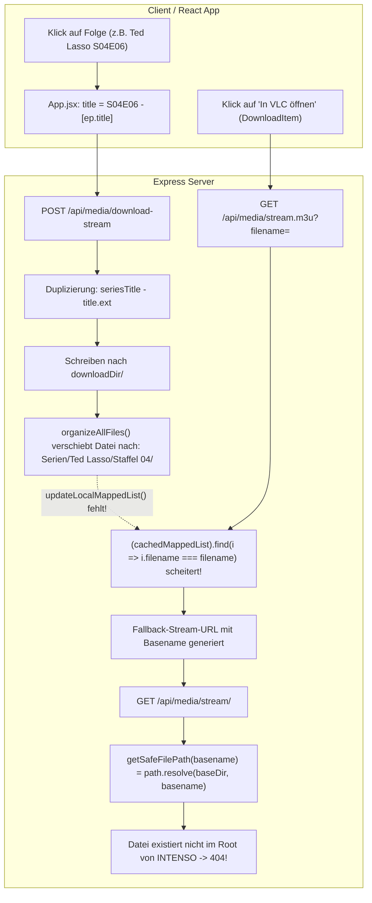
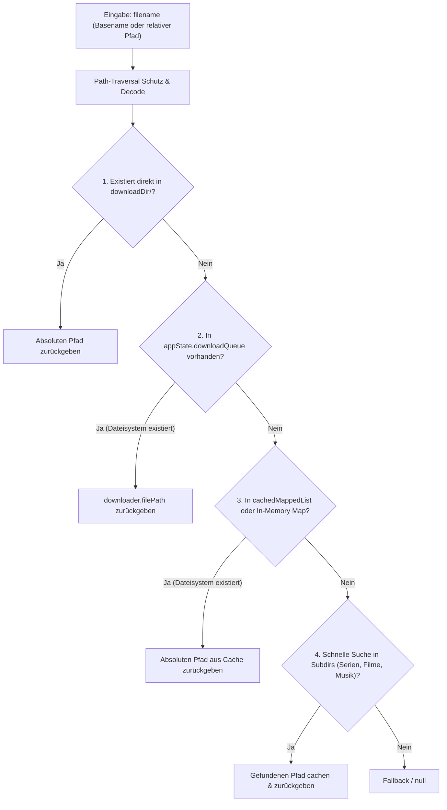
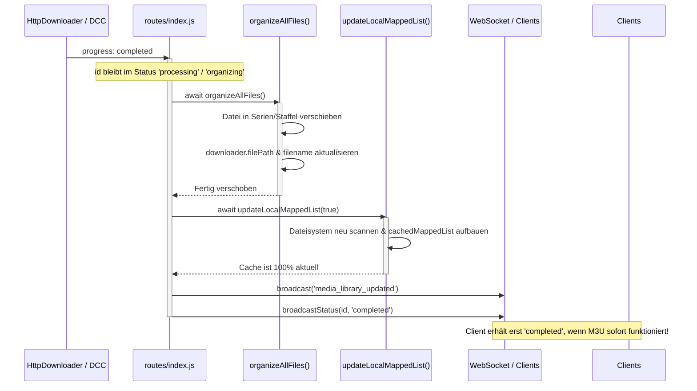

# AGY.md — Architektur- & Implementierungsplan: Robuste Pfadauflösung, M3U-Streaming & Namensbereinigung

**Projekt:** PulseCast (`xdcc-load-cast`)  
**Pfade:** `/home/yash/Projects/xdcc-load-cast` & `/home/yash/xdcc-load-cast`  
**Datum:** 17. September 2026  
**Status:** Detaillierte Fehleranalyse abgeschlossen / Architektur & Implementierung spezifiziert  

---

## 1. Problemstellung & Verifikation am Live-System

### 1.1 Symptom
Wenn der Benutzer eine neue Datei (z. B. *Ted Lasso Staffel 4 Folge 6* oder *Folge 7*) über den Xtream-VOD-Bereich herunterlädt, schlägt die Wiedergabe über die generierte `.m3u` Playlist in VLC mit einem **HTTP 404 (File Not Found)** fehl. Ältere Dateien, die bereits vor dem Download im Dateisystem lagen, lassen sich hingegen abspielen.

### 1.2 Live-Reproduktion am Server (Port 3000)
1. **M3U-Generierung mit Basename:**
   ```bash
   curl -s "http://localhost:3000/api/media/stream.m3u?filename=Ted%20Lasso%20(2020)%20DE%20-%20S04E06%20-%20Ted%20Lasso%20(2020)%20DE%20-%20S04E06%20-%20Vorsicht%20beim%20Springen!.mkv"
   ```
   *Ergebnis:*
   ```text
   #EXTM3U
   #EXTINF:-1 tvg-name="Ted Lasso...", ...
   http://localhost:3000/api/media/stream/Ted%20Lasso%20(2020)%20DE%20-%20S04E06%20-%20Ted%20Lasso%20(2020)%20DE%20-%20S04E06%20-%20Vorsicht%20beim%20Springen!.mkv
   ```
2. **Abruf der Stream-URL durch VLC:**
   ```bash
   curl -I "http://localhost:3000/api/media/stream/Ted%20Lasso%20(2020)%20DE%20-%20S04E06%20-%20Ted%20Lasso%20(2020)%20DE%20-%20S04E06%20-%20Vorsicht%20beim%20Springen!.mkv"
   # -> HTTP/1.1 404 Not Found
   ```
3. **Abruf mit vollständigem relativem Pfad zum Unterordner:**
   ```bash
   curl -I "http://localhost:3000/api/media/stream/Serien/Ted%20Lasso/Staffel%2004/Ted%20Lasso%20(2020)%20DE%20-%20S04E06%20-%20Ted%20Lasso%20(2020)%20DE%20-%20S04E06%20-%20Vorsicht%20beim%20Springen!.mkv"
   # -> HTTP/1.1 200 OK (Content-Length: 3967008550, Content-Type: video/x-matroska)
   ```

---

## 2. Detaillierte Ursachen-Analyse (Root Causes)



### Ursache 1: Starre Pfad-Auflösung in `getSafeFilePath(filename)`
- In `services/media-library.js` (Zeile 49–57):
  ```javascript
  function getSafeFilePath(filename) {
    if (!filename) return null;
    const baseDir = path.resolve(appState.appConfig.downloadDir);
    const filePath = path.resolve(baseDir, filename);
    if (!filePath.startsWith(baseDir)) return null;
    return filePath;
  }
  ```
- Wenn `filename` nur der Basename ist (z. B. `Ted Lasso (2020) DE - S04E06 - ...mkv`), sucht `path.resolve(baseDir, filename)` ausschließlich direkt im Wurzelverzeichnis `/media/yash/INTENSO/`.
- Da `organizeAllFiles()` die Datei bereits nach `/media/yash/INTENSO/Serien/Ted Lasso/Staffel 04/` verschoben hat, existiert die Datei im Root nicht mehr. `fs.existsSync(filePath)` liefert `false` und der HTTP Range Stream bricht mit 404 ab.

### Ursache 2: M3U-Generierung & Cache-Desynchronisation
- **In `/api/media/stream.m3u`:**
  ```javascript
  const item = (appState.cachedMappedList || []).find(i => i.filename === filename) || {
    filename,
    metadata: { title: path.parse(filename).name }
  };
  ```
  In `cachedMappedList` lautet `item.filename` `Serien/Ted Lasso/Staffel 04/...mkv` (relativer Pfad). Wenn die Route mit `filename=<basename>` aufgerufen wird, scheitert der strikte Vergleich `i.filename === filename`.
  Der Fallback erzeugt einen Stream-Link mit dem reinen Basename (`/api/media/stream/<basename>`), der wegen Ursache 1 auf 404 läuft.
- **Veralteter Cache nach Download:**
  Beim Download-Abschluss wird `appState.cachedLocalFiles = null` gesetzt, aber `updateLocalMappedList()` wird **nicht** ausgeführt. `appState.cachedMappedList` bleibt veraltet, bis ein Client zufällig `GET /api/media-library` aufruft.
- **In `/api/media/season.m3u`:**
  Die Route ignoriert den vom Frontend gesendeten Parameter `req.query.filenames` vollständig. Sie sucht ausschließlich im potentiell veralteten `cachedMappedList` nach dem Serientitel. Bei fehlendem Cache oder nicht aktualisierter Bibliothek gibt die Route 404 zurück.

### Ursache 3: Redundante Dateinamen bei Xtream-Downloads
- In `routes/index.js` (Zeile 1311):
  ```javascript
  let filename = validCustomFilename || (seriesTitle ? `${seriesTitle} - ${title}${extension}` : `${title || 'Stream_Download'}${extension}`);
  ```
- Und in `client/src/App.jsx` (Zeile 951):
  ```javascript
  const rawTitle = item.title || item.name || 'Stream';
  const seasonEpisode = item.metadata?.seasonEpisode || '';
  const title = seasonEpisode ? `${seasonEpisode} - ${rawTitle}` : rawTitle;
  ```
- Xtream-Provider liefern im Feld `ep.title` häufig bereits den kompletten Titel samt Staffel und Serie (z. B. `Ted Lasso (2020) DE - S04E06 - Vorsicht beim Springen!`).
- Dadurch wird `seriesTitle` zweifach und `S04E06` zweifach vorangestellt:
  `Ted Lasso (2020) DE - S04E06 - Ted Lasso (2020) DE - S04E06 - Vorsicht beim Springen!.mkv`.
- Weil der Dateiname abweicht, greift auch die Duplikatserkennung nicht, sodass dieselbe Episode mehrfach heruntergeladen wird.

### Ursache 4: Fehlende Synchronisation nach Download
- In `routes/index.js` (Zeile 1334–1343):
  ```javascript
  downloader.on('progress', (data) => {
    if (data.status === 'completed') {
      appState.cachedLocalFiles = null;
      organizeAllFiles().catch(err => console.error('[Stream Download] Organize error:', err));
      processNextHttpDownload();
    }
    broadcastStatus(id);
  });
  ```
- `broadcastStatus(id)` meldet dem Client sofort `status: 'completed'`.
- `organizeAllFiles()` läuft im Hintergrund asynchron weiter. Der Benutzer sieht in der UI sofort den Play-Button, klickt darauf, während die Datei entweder gerade verschoben wird oder `cachedMappedList` noch nicht aktualisiert wurde.

### Ursache 5: Bereits vorhandene Dateiduplikate auf dem Datenträger
Auf `/media/yash/INTENSO` existieren bereits mehrere doppelt/ungünstig benannte Dateien:
- `/media/yash/INTENSO/Serien/Ted Lasso/Staffel 04/Ted Lasso (2020) DE - S04E06 - Ted Lasso (2020) DE - S04E06 - Vorsicht beim Springen!.mkv` (Redundantes Duplikat von `... - Vorsicht beim Springen!.mkv`)
- `/media/yash/INTENSO/Serien/Ted Lasso/Staffel 04/Ted Lasso (2020) DE - S04E07 - Ted Lasso (2020) DE - S04E07 - Ja und, Baby.mkv` (Enthält doppelte Benennung)
- `/media/yash/INTENSO/Serien/Widow's Bay/Staffel 01/Widow's Bay (2026) DE - S01E06 - Widow's Bay (2026) DE - S01E06 - Unsere Geschichte.mkv`
- `/media/yash/INTENSO/Serien/True Detective/Staffel 03/True Detective (2014) DE - S03E04 - True Detective (2014) - S03E04.mkv`

---

## 3. Architektur- & Lösungs-Design

### 3.1 Robuste 4-Stufen-Pfadauflösung in `getSafeFilePath(filename)`

`getSafeFilePath(filename)` wird von einer einfachen String-Verknüpfung zu einer kaskadierten, sicheren Auflösungsfunktion erweitert:



#### Spezifikation der Stufen:
1. **Stufe 1 — Direkter Pfad:**
   - Bereinigung von URL-Encodings (`decodeURIComponent`) und Windows-Slashes (`\`).
   - `candidate = path.resolve(baseDir, filename)`
   - Sicherstellen, dass `candidate.startsWith(baseDir)` (Schutz vor Path Traversal wie `../../`).
   - Wenn `fs.existsSync(candidate) && fs.statSync(candidate).isFile()`, sofort zurückgeben.
2. **Stufe 2 — Download-Queue Abgleich:**
   - Suche in `appState.downloadQueue.values()`:
     - Prüfen, ob `item.downloader.filename === targetBase` oder `path.basename(item.downloader.filePath) === targetBase`.
     - Wenn `item.downloader.filePath` auf der Festplatte existiert und innerhalb von `baseDir` liegt: Pfad zurückgeben.
3. **Stufe 3 — In-Memory Bibliotheks-Index:**
   - Abgleich gegen `appState.cachedMappedList`:
     - Match auf `item.filename === filename` ODER `path.basename(item.filename) === targetBase`.
     - Bei Treffer: Prüfen von `path.resolve(baseDir, item.filename)`.
   - Pflegen eines schnellen `Map<string, string>` (Basename -> Relativer Pfad), der bei jedem Bibliotheks-Scan aktualisiert wird (O(1) Zugriff).
4. **Stufe 4 — Schneller Subdirectory-Fallback:**
   - Gezielte Prüfung in den Standard-Ordnern:
     - `Filme/<targetBase>`
     - `Musik/<targetBase>`
     - `Musik/Hörbücher/<targetBase>`
   - Für Serien: Gezielter flacher Scan der Serie/Staffel-Ordner in `Serien/*/*/<targetBase>` mit maximaler Rekursionstiefe 3.
   - Bei Treffer: Im Basename-Index speichern und Pfad zurückgeben.

---

### 3.2 Zuverlässige M3U-Generierung (`stream.m3u` & `season.m3u`)

#### 1. Einzeldatei-Playlist: `/api/media/stream.m3u`
- Parameter: `filename` (kann Basename oder relativer Pfad sein).
- **Ablauf:**
  1. Auflösung der echten Datei über `getSafeFilePath(filename)`.
  2. Wenn die Datei existiert:
     - Ermittlung des echten relativen Pfads: `relPath = path.relative(downloadDir, resolvedPath)`.
     - Abruf der Metadaten aus `cachedMappedList` oder `metadataCache[relPath]`.
     - Stream-URL in der M3U lautet **immer**:
       `${baseUrl}/api/media/stream/${encodeURIComponent(relPath)}`
  3. Falls die Datei nicht lokal auflösbar ist (z. B. Stream-URL): Fallback mit sauber kodiertem Pfad.
- **Ergebnis:** VLC erhält immer die exakte, auf der Platte existierende relative URL.

#### 2. Staffel-Playlist: `/api/media/season.m3u`
- Parameter:
  - `filenames` (optional, kommaseparierte Liste von Dateipfaden aus dem Frontend).
  - `series` / `seriesTitle` (Serientitel).
  - `season` / `seasonNum` (Staffelnummer).
- **Ablauf:**
  1. **Pfad A — `filenames` übergeben (bevorzugt):**
     - Das Frontend weiß beim Rendern der Staffelansicht exakt, welche Episoden zur Staffel gehören.
     - Jede Datei in `filenames` wird über `getSafeFilePath()` geprüft und mit Metadaten angereichert.
  2. **Pfad B — Seriensuche via Cache:**
     - Falls `cachedMappedList` leer ist oder keine Treffer liefert: Sofortiges synchrones `await updateLocalMappedList(true)` ausführen!
     - Robuste Filterung (Groß-/Kleinschreibung ignorieren, Jahreszahlen wie `(2020)` und Sprachkürzel wie `DE` flexibel matchen).
  3. **Episoden-Deduplizierung:**
     - Falls für eine Staffel & Episode mehrere Dateien existieren (z. B. Ted Lasso S04E06 alt vs. neu):
     - Es wird nur die sauberere bzw. existierende Datei in die Playlist aufgenommen (keine doppelten Einträge in VLC!).
  4. **Metadaten-Formatierung:**
     - `#EXTINF` enthält den sauberen Episodentitel (`Ted Lasso - S04E06 - Vorsicht beim Springen!`) anstelle von wiederholten Titeln.

---

### 3.3 Intelligente Dateinamen-Generierung (`sanitizeStreamFilename`)

Um Benennungen wie `Ted Lasso (2020) DE - S04E06 - Ted Lasso (2020) DE - S04E06 - Vorsicht beim Springen!.mkv` dauerhaft zu verhindern, wird eine zentrale Bereinigungsfunktion implementiert:

```javascript
export function sanitizeStreamFilename({ seriesTitle, title, seasonEpisode, extension = '.mp4' }) {
  // 1. Extension normalisieren
  let cleanExt = extension.startsWith('.') ? extension.toLowerCase() : `.${extension.toLowerCase()}`;
  
  // 2. Roh-Titel von bestehender Dateiendung bereinigen
  let cleanTitle = (title || '').replace(/\.(mkv|mp4|avi|ts|mov|webm)$/i, '').trim();
  let cleanSeries = (seriesTitle || '').trim();

  // 3. Staffel-/Episoden-Muster (z.B. S04E06 oder 4x06) erkennen
  const seRegex = /(?:S(\d{1,2})E(\d{1,2})|(\d{1,2})x(\d{1,2}))/i;
  let canonicalSE = seasonEpisode;
  if (!canonicalSE) {
    const seMatch = cleanTitle.match(seRegex) || cleanSeries.match(seRegex);
    if (seMatch) {
      const s = seMatch[1] || seMatch[3];
      const e = seMatch[2] || seMatch[4];
      canonicalSE = `S${String(s).padStart(2, '0')}E${String(e).padStart(2, '0')}`;
    }
  }

  // 4. SeriesTitle von evtl. enthaltenem SxxExx bereinigen
  if (cleanSeries) {
    cleanSeries = cleanSeries.replace(seRegex, '').replace(/[\s\-_]+$/, '').trim();
  }

  // 5. Redundante Serien- und Episoden-Präfixe aus cleanTitle iterativ entfernen
  if (cleanSeries) {
    let prev;
    do {
      prev = cleanTitle;
      // Entferne Serientitel am Anfang (case-insensitive)
      const seriesPrefixRegex = new RegExp(`^${escapeRegex(cleanSeries)}[\\s\\-_:]*`, 'i');
      cleanTitle = cleanTitle.replace(seriesPrefixRegex, '').trim();
      // Entferne SxxExx am Anfang
      cleanTitle = cleanTitle.replace(/^(?:S\d{1,2}E\d{1,2}|\d{1,2}x\d{1,2})[\s\-_:]*/i, '').trim();
    } while (cleanTitle !== prev);
  }

  // 6. Finale Zusammensetzung
  let finalBase;
  if (cleanSeries && canonicalSE) {
    finalBase = cleanTitle ? `${cleanSeries} - ${canonicalSE} - ${cleanTitle}` : `${cleanSeries} - ${canonicalSE}`;
  } else if (cleanSeries) {
    finalBase = cleanTitle ? `${cleanSeries} - ${cleanTitle}` : cleanSeries;
  } else {
    finalBase = cleanTitle || 'Stream_Download';
  }

  // 7. Illegale Zeichen bereinigen
  finalBase = finalBase.replace(/[\\/:*?"<>|]/g, '_').replace(/\s+/g, ' ').trim();
  return `${finalBase}${cleanExt}`;
}
```

#### Anpassung im Frontend (`client/src/App.jsx`):
- `title` wird vor dem Senden an `POST /api/media/download-stream` nicht mehr blind mit `${seasonEpisode} - ` konkateniert, wenn `title` bereits `seasonEpisode` enthält.

---

### 3.4 Synchroner Download-Lifecycle: Download -> Organize -> Library Update

Die Race Condition zwischen Download-Abschluss, Datei-Verschiebung und Cache-Aktualisierung wird durch eine strikt sequentielle Abarbeitung beseitigt:



- `organizeAllFiles()` ruft vor Beendigung immer `await updateLocalMappedList(true)` auf.
- `updateDownloaderFilePath(oldPath, newPath)` aktualisiert nicht nur `downloader.filePath`, sondern synchronisiert auch `downloader.filename`.
- Der Client erhält das WebSocket-Signal `completed` **erst**, wenn die Datei am Zielort liegt und im Katalog indiziert ist.

---

### 3.5 Bereinigung bestehender Dateileichen auf `/media/yash/INTENSO`

Ein idempotentes Migrations- und Bereinigungsskript (`scripts/cleanup-duplicates.js`) wird erstellt und einmalig ausgeführt:

1. **Ted Lasso Staffel 4 Folge 6:**
   - Datei 1: `Ted Lasso (2020) DE - S04E06 - Vorsicht beim Springen!.mkv` (3.966.260.529 Bytes)
   - Datei 2: `Ted Lasso (2020) DE - S04E06 - Ted Lasso (2020) DE - S04E06 - Vorsicht beim Springen!.mkv` (3.967.008.550 Bytes)
   - *Aktion:* Datei 2 ist ein redundantes Duplikat. Datei 2 wird gelöscht, Metadaten-Cache-Eintrag bereinigt.
2. **Ted Lasso Staffel 4 Folge 7:**
   - Datei: `Ted Lasso (2020) DE - S04E07 - Ted Lasso (2020) DE - S04E07 - Ja und, Baby.mkv`
   - *Aktion:* Da hier keine saubere Datei existiert, wird die Datei sicher umbenannt in:  
     `Ted Lasso (2020) DE - S04E07 - Ja und, Baby.mkv`.
3. **Widow's Bay Staffel 1 Folge 6:**
   - Datei: `Widow's Bay (2026) DE - S01E06 - Widow's Bay (2026) DE - S01E06 - Unsere Geschichte.mkv`
   - *Aktion:* Umbenennen in `Widow's Bay (2026) DE - S01E06 - Unsere Geschichte.mkv`.
4. **True Detective Staffel 3 Folge 4:**
   - Datei: `True Detective (2014) DE - S03E04 - True Detective (2014) - S03E04.mkv`
   - *Aktion:* Umbenennen in `True Detective (2014) DE - S03E04.mkv`.
5. **Cache-Aktualisierung:**
   - Aufruf von `updateLocalMappedList(true)` und Speichern von `.metadata_cache.json`.

---

## 4. Konkreter Implementierungsplan nach Dateien

### 4.1 `services/media-library.js`
1. **Erweiterung von `getSafeFilePath(filename)`:**
   - Implementierung der 4-stufigen Auflösung (Direct -> Queue -> Cache -> Subdirectory Search).
   - Absicherung gegen Directory Traversal (`filePath.startsWith(baseDir)`).
2. **Pflege des In-Memory Basename-Index:**
   - `basenameIndex = new Map()`: Bildet `path.basename(relPath)` auf `relPath` ab.
   - Aktualisierung bei jedem `scanDownloadDir()` und `organizeAllFiles()`.
3. **Synchronisierung in `organizeAllFiles()`:**
   - Am Ende von `organizeAllFiles()`: `await updateLocalMappedList(true)`.
   - `updateDownloaderFilePath(oldPath, newPath)`: Aktualisierung von `filePath` und `filename` in `appState.downloadQueue`.

### 4.2 `services/m3u-service.js`
1. **`generateSingleItemM3u(item, baseUrl)`:**
   - Auflösen des echten relativen Pfads.
   - Saubere Formatierung des `#EXTINF`-Titels ohne Wiederholungen.
2. **`generateSeasonM3u(seriesTitle, seasonNum, episodes, baseUrl)`:**
   - Deduplizierung von Episoden anhand der Episodennummer.
   - Exakte relative Pfade in den generierten Stream-URLs.

### 4.3 `routes/index.js`
1. **Helper `sanitizeStreamFilename()` einbauen:**
   - Beseitigung aller doppelten Serien- und Episoden-Präfixe.
2. **Route `POST /api/media/download-stream` anpassen:**
   - Erzeugung von `filename` über `sanitizeStreamFilename()`.
   - Duplikaterkennung in `downloadQueue` mit bereinigtem Namen abgleichen.
3. **Download-Completion-Pipeline überarbeiten:**
   - Sequentielles Ausführen von `await organizeAllFiles()` und `await updateLocalMappedList(true)` im Event `'completed'` vor dem Senden von `broadcastStatus(id)`.
4. **Route `GET /api/media/stream.m3u` härten:**
   - `getSafeFilePath(filename)` aufrufen, echten relativen Pfad ermitteln und in die Playlist schreiben.
5. **Route `GET /api/media/season.m3u` erweitern:**
   - Auswertung von `req.query.filenames` (Kommaseparierte Liste auflösen).
   - Fallback mit automatischem Cache-Refresh (`updateLocalMappedList(true)`), falls Liste leer ist.

### 4.4 `client/src/App.jsx`
1. **`triggerStreamDownload` anpassen:**
   - Nicht mehr doppelt `seasonEpisode` voranstellen, wenn der Titel dies bereits beinhaltet.
2. **`openInVlc` & `openSeasonInVlc`:**
   - `openSeasonInVlc` übergibt saubere `filenames` an die Route.

### 4.5 `scripts/cleanup-duplicates.js`
- Wartungsskript zur Bereinigung der bereits heruntergeladenen doppelten Dateien auf der Festplatte.

---

## 5. Detaillierter Test- und Verifikationsplan

### 5.1 Automatisierte Unit-Tests
1. **`tests/media-library-path.test.js` (Neu):**
   - Test: `getSafeFilePath` findet Datei bei Übergabe des relativen Pfads.
   - Test: `getSafeFilePath` findet Datei bei Übergabe des reinen Basenames (auch wenn sie in `Serien/...` liegt).
   - Test: `getSafeFilePath` blockiert Path-Traversal-Versuche (`../../etc/shadow`).
   - Test: `getSafeFilePath` findet aktive Downloads aus `downloadQueue`.
2. **`tests/filename-sanitizer.test.js` (Neu):**
   - Test: Bereinigung doppelter Seriennamen (`Ted Lasso ... - Ted Lasso ...`).
   - Test: Bereinigung doppelter Episoden-Tags (`S04E06 - S04E06`).
   - Test: Korrektes Verhalten bei Einzelfilmen.
3. **`tests/m3u-service.test.js`:**
   - Test: `generateSingleItemM3u` mit relativen Pfaden.
   - Test: `generateSeasonM3u` mit Deduplizierung.
4. **Ausführung der Suite:**
   ```bash
   npm test
   ```

### 5.2 Integrationstest & End-to-End Verifikation am Live-System
1. **Verifikation nach Cleanup:**
   - Überprüfung des Verzeichnisses `/media/yash/INTENSO/Serien/Ted Lasso/Staffel 04/`.
   - Sicherstellen, dass keine doppelten `Ted Lasso ... Ted Lasso ...` MKV-Dateien mehr existieren.
2. **Test des VLC Stream M3U-Endpunkts via curl:**
   - Aufruf von:
     ```bash
     curl -s "http://localhost:3000/api/media/stream.m3u?filename=Ted%20Lasso%20(2020)%20DE%20-%20S04E06%20-%20Vorsicht%20beim%20Springen!.mkv"
     ```
   - Stream-URL aus der M3U per `curl -I` abrufen -> **Muss HTTP 200 OK liefern!**
3. **Test der Staffel-M3U:**
   - Aufruf von:
     ```bash
     curl -s "http://localhost:3000/api/media/season.m3u?series=Ted%20Lasso&season=4"
     ```
   - Verifizieren, dass alle Folgen (Folge 6, Folge 7) sauber und ohne Duplikate enthalten sind.
4. **Test eines Neu-Downloads (End-to-End):**
   - Test-Download einer beliebigen Episode über `POST /api/media/download-stream`.
   - Überprüfen des generierten Dateinamens (keine doppelten Präfixe).
   - Nach Fertigstellung: Klick auf "In VLC öffnen" -> M3U lädt herunter -> VLC öffnet sich und spielt ohne 404 ab.
