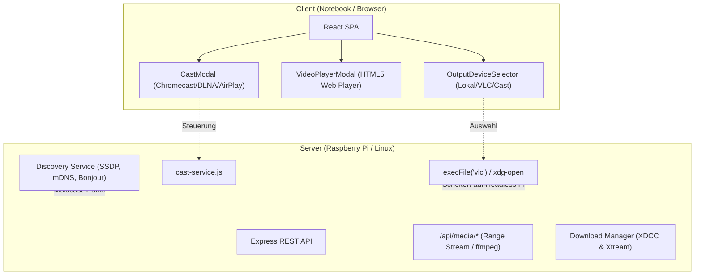
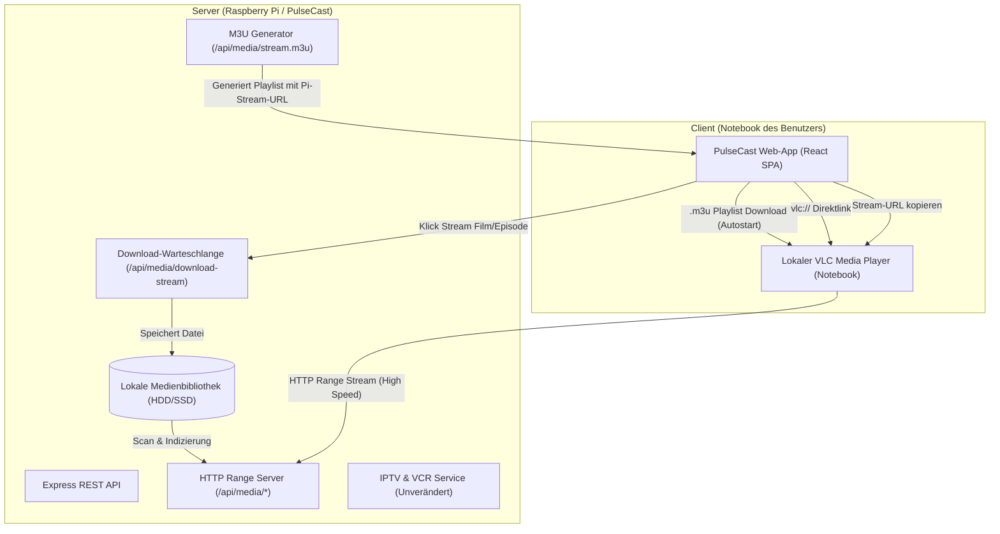

# AGY.md — Umbau-Plan: Client-Streaming & Download-Hub

**Projekt:** PulseCast (`xdcc-load-cast`)  
**Pfad:** `/home/yash/Projects/xdcc-load-cast`  
**Datum:** 17. September 2026  
**Status:** In Planung / Spezifiziert  

---

## 1. Executive Summary & Zielsetzung

PulseCast wird von einem hybriden Medien-Hub (der fälschlicherweise versuchte, Medien direkt auf dem Server bzw. Raspberry Pi via `execFile('vlc')`, über einen internen Web-Player oder per Chromecast/DLNA abzuspielen) in ein **leistungsfähiges, schlankes Download- und Streaming-Backend** umgebaut:

1. **Kein Medienwiedergabe-Gerät mehr auf dem Server:**
   - Vollständige Entfernung des server-seitigen VLC-Starts (`execFile('vlc')`).
   - Vollständiges Entfernen bzw. Deaktivieren des internen Web-Players (`VideoPlayerModal`) sowie der Cast-Dienste (`CastModal`, `cast-service`, Gerätediscovery).
   - Wegfall der Gerätediscovery-Warteschlangen und des `OutputDeviceSelector`.
2. **Lokale Bibliothek als zentrale Kernfunktion:**
   - Klare, aufgeräumte und übersichtliche Präsentation der lokal gespeicherten Filme, Serien, Episoden, Hörbücher und Musik.
   - Nahtloser Start der Medien direkt im **VLC Media Player auf dem Client/Notebook des Benutzers**:
     - `.m3u` Playlist-Download (MIME: `application/x-mpegurl` oder `video/x-mpegurl`) für sofortigen Autostart in VLC.
     - Direkter `vlc://`-Protokolllink für 1-Klick-Öffnen ohne Download-Umweg.
     - Komfortable Option zum Kopieren der direkten Stream-URL in die Zwischenablage.
3. **IPTV-Bereich bleibt unverändert:**
   - Live-TV-Sender, EPG-Programmführer (`EpgModal`) und geplante VCR-Aufnahmen (`VcrModal`, `vcr.js`) bleiben zu 100 % erhalten.
4. **Stream-Bereich (Xtream VOD / NetflixBrowse):**
   - Klick auf Filme, Serien oder Episoden startet **keinen** Player mehr.
   - Stattdessen wird der gewählte Inhalt direkt in die Download-Warteschlange eingereiht (`POST /api/media/download-stream`), damit er nach Fertigstellung dauerhaft und performant in der lokalen Mediathek via VLC gestreamt werden kann.

---

## 2. Architektur & IST-Zustand

### 2.1 IST-Zustand & Schwachstellen



#### Hauptprobleme des IST-Zustands:
1. **Server-Side Playback Paradoxon:** `launchVlc()` in `cast-service.js` rief `execFile('vlc', [target])` auf dem Host-System auf. Läuft der Server headless auf einem Raspberry Pi, schlägt der Aufruf fehl oder versucht Audio/Video auf dem lokalen HDMI-Port des Pi auszugeben – völlig am Benutzer vorbei, der am Notebook sitzt.
2. **Ressourcenverschwendung durch Cast Discovery:** `discovery.js` startete permanente mDNS- und SSDP-Discovery-Dienste (`chromecast-api`, `dlnacasts2`, `airplayer`) mit Polling-Intervallen, was kontinuierlich CPU und Netzwerk auf dem Pi belastete.
3. **Fehlgeschlagene Streams im Web-Player:** Viele Container (z.B. MKV mit DTS/AC3/TrueHD, AVI, oder hohe Bitraten) überforderten den internen Web-Player (`VideoPlayerModal`) oder erforderten CPU-intensives On-the-Fly Transcoding mit `ffmpeg`.
4. **Inkohärente Benutzerführung im Stream-Bereich:** Das Anklicken eines Films oder einer Serien-Episode im Xtream-Stream-Bereich versuchte eine direkte Wiedergabe im Web-Player, anstatt den Download zu starten, der für eine flüssige Wiedergabe erforderlich ist.

---

### 2.2 SOLL-Architektur



#### Kernprinzipien der SOLL-Architektur:
- **Server als reiner Dienst:** Der Pi kümmert sich ausschließlich um Download-Verwaltung, Medienspeicherung, Metadaten-Organisation und HTTP-Range-Streaming.
- **Client als Abspielgerät:** Sämtliche Medienwiedergabe findet nativ auf dem Notebook in VLC statt. VLC unterstützt alle Codecs (MKV, 10-bit HEVC, DTS, AC3, Subtitles) nativ ohne Transcoding-Last auf dem Pi.
- **Drei Stream-Optionen:**
  1. **`.m3u` Playlist:** Durch den passenden MIME-Typ und Dateiendung öffnet der Browser die Datei direkt mit dem verknüpften VLC Player.
  2. **`vlc://` URI:** Direkter Aufruf des Betriebssystem-Handlers für VLC.
  3. **Stream-URL:** Kopieren per Klick für freie Nutzung (z.B. Strg+N in VLC, IINA, MPV).
- **Automatischer Übergang:** VOD-Inhalte aus dem Stream-Bereich werden per Klick heruntergeladen, landen nach Abschluss automatisch in der lokalen Mediathek und können dort direkt gestreamt werden.

---

## 3. Geplante Änderungen pro Komponente und Datei

### 3.1 Backend (Node.js / Express)

#### 1. `services/cast-service.js`
- **Änderungen:**
  - `launchVlc()` und `playLocalFile()` komplett entfernen (keine `execFile('vlc')`, `execFile('open')`, `execFile('xdg-open')` mehr).
  - Cast-Intervalle (`setInterval` zur Statusabfrage von Chromecast/DLNA) entfernen.
  - Discovery- und Cast-Steuerungsmethoden deaktivieren/entfernen.
- **Export für Rückwärtskompatibilität:** Falls noch Rumpf-Imports existieren, neutrale No-Op-Funktionen oder Auslagerung in ein schlankes Hilfsmodul.

#### 2. `services/discovery.js`
- **Änderungen:**
  - Deaktivierung der Initialisierung von `chromecast-api`, `dlnacasts2`, `airplayer`.
  - `startAllDiscovery()` wird zu einer No-Op-Funktion, wodurch Netzwerk-Sockets und mDNS-Last auf dem Pi eliminiert werden.

#### 3. `services/m3u-service.js`
- **Bestehend:** `generateM3uPlaylist(baseUrl)` für die Gesamt-Playlist existiert bereits.
- **Erweiterung:** Neue Hilfsfunktionen hinzufügen:
  - `generateSingleItemM3u(item, baseUrl)`: Generiert eine Playlist für eine einzelne Datei mit Metadaten (`#EXTINF:-1 tvg-logo="..." , Title`).
  - `generateSeasonM3u(seriesTitle, seasonNum, episodes, baseUrl)`: Generiert eine Playlist für eine komplette Serienstaffel, sodass VLC alle Folgen der Staffel nacheinander abspielt.

#### 4. `routes/index.js`
- **Zu entfernende / deaktivierende Routen:**
  - `POST /api/player/vlc`
  - `POST /api/media-library/play-vlc`
  - `POST /api/download/:id/play-local`
  - `POST /api/download/:id/play-vlc`
  - `GET /api/chromecast/devices`
  - `POST /api/download/:id/cast`
  - `POST /api/cast/control`
  - `POST /api/cast/stop`
  - `GET /api/cast/active`
  - `POST /api/media-library/cast/play`
  - `POST /api/media-library/cast/control`
  - `POST /api/media-library/cast/stop`
- **Neue & optimierte Streaming-Routen:**
  - `GET /api/media/stream.m3u`:
    - Query-Parameter: `filename` (Pfad der lokalen Datei).
    - Ermittelt dynamisch die Basis-URL über `req.headers.host`.
    - Setzt Response-Header:
      ```http
      Content-Type: application/x-mpegurl; charset=utf-8
      Content-Disposition: attachment; filename="<sauberer_titel>.m3u"
      Cache-Control: no-cache
      ```
    - Liefert `#EXTM3U` mit absolutem Link zu `/api/media/<encoded-filename>`.
  - `GET /api/media/season.m3u`:
    - Query-Parameter: `series` (Serientitel oder IMDb-ID), `season` (Staffelnummer).
    - Generiert eine Multi-Item-Playlist für die gesamte Staffel.
- **Konsolidierung `/api/media/download-stream`:**
  - Sicherstellen, dass die Route sowohl Xtream-Filme als auch Xtream-Episoden sauber mit Titel, Staffelinforamtion und bereinigtem Zieldateinamen in die `downloadQueue` einreiht.
  - Eindeutige Rückmeldung mit `id`, `filename` und `status: 'queued' | 'connecting'`.
- **Erhalt der IPTV-Routen:**
  - `/api/iptv/*`, `/api/vcr/*`, `/api/playlist.m3u`, `/api/iptv/epg.xml` bleiben vollständig unberührt.

#### 5. `server.js` & `state.js`
- **`server.js`:**
  - Aufruf von `startAllDiscovery()` entfernen.
  - WebSocket-Initialnachricht `activeCasts` entfernen.
- **`state.js`:**
  - Cast-spezifische Maps (`discoveredChromecasts`, `discoveredDlnas`, `discoveredAirplays`, `activeCasts`) bereinigen bzw. als leere Dummys belassen.

---

### 3.2 Frontend (React / Vite)

#### 1. Entfernung / Deaktivierung von Playern & Cast-Modals
- **`VideoPlayerModal.jsx`:** Entfernen aus `App.jsx`.
- **`CastModal.jsx`:** Entfernen aus `App.jsx`.
- **`OutputDeviceSelector.jsx`:**
  - Aus `AppHeader.jsx` und `NetflixBrowse.jsx` entfernen.
  - Das Konzept eines "Ausgabegeräts" entfällt vollständig, da die Ausgabe immer auf dem Client via VLC erfolgt.

#### 2. `NetflixBrowse.jsx` (Hauptansicht im Media-Modus)
- **Header:**
  - `OutputDeviceSelector` entfernen.
  - Tabs: `Lokal`, `Stream`, `IPTV` beibehalten.
- **Tab "Stream" (Xtream VOD):**
  - **Klick auf Film-Karte:** Kein Player! Ruft direkt die Download-Funktion auf (`POST /api/media/download-stream`).
  - **Hero-Banner im Stream-Tab:** Button ändert sich von "▶ Abspielen" zu "📥 In Download-Warteschlange".
  - **Klick auf Serie:** Öffnet wie gewohnt `SeriesDetailView`, jedoch mit Download-Aktionen.
  - **Toast-Notification:** Bei Klick sofortiges visuelles Feedback: *"Download gestartet: [Titel] wurde zur Warteschlange hinzugefügt."*
- **Tab "Lokal":**
  - Übersichtliche Anzeige der lokalen Filme und Serien.
  - **Klick auf Film-Karte:** Öffnet das neue VLC-Streaming-Aktionsmenü (Standard: Download der `.m3u` Playlist zum direkten Start in VLC).
  - Zusätzliche Schnellaktionen auf der Karte / im Overlay:
    - 📥 `.m3u` (Playlist-Download für Autostart in VLC)
    - 🚀 `vlc://` (Direktlink)
    - 📋 Link kopieren (Stream-URL in Zwischenablage)
  - **Klick auf Serie:** Öffnet `SeriesDetailView` der lokalen Episoden.
- **Tab "IPTV":**
  - Bleibt unverändert. Senderliste, EPG und VCR-Aufnahmeplanung bleiben vollständig intakt.

#### 3. `SeriesDetailView.jsx` (Serien-Detailansicht)
- **Unterscheidung nach Quelle (`series.isXtream`):**
  - **Fall A: Stream-Serie (`series.isXtream === true`):**
    - Klick auf eine Episode ruft `onDownloadStream(episode)` auf (anstelle von `onPlay`).
    - Episoden-Icon zeigt "📥" statt "▶".
    - Neuer Button im Header: *"Ganze Staffel herunterladen"* (nutzt Batch-Download).
  - **Fall B: Lokale Serie (`series.isXtream === false`):**
    - Klick auf eine Episode startet das VLC-Client-Streaming (.m3u Download / vlc:// Link / URL kopieren).
    - Neuer Button: *"Ganze Staffel in VLC abspielen (.m3u)"*.

#### 4. `MediaLibrary.jsx` & `MediaCard.jsx`
- **`MediaCard.jsx`:**
  - Cast-Button (`<CastIcon />`) und Cast-Status-Container (`activeCastForFile`) komplett entfernen.
  - Für lokale Medien (`!item.isXtream`):
    - Haupt-Button: "In VLC abspielen" (lädt `.m3u` herunter).
    - Zusätzliche Aktionsbuttons: `vlc://` Protokolllink und "Stream-URL kopieren" mit Feedback.
  - Für Stream-Medien (`item.isXtream`):
    - Haupt-Aktion: "Herunterladen" (`/api/media/download-stream`).
- **`MediaLibrary.jsx`:**
  - Hervorhebung der lokalen Kategorien (*"Lokale Filme"*, *"Lokale Serien"*, *"Musik"*, *"Hörbücher"*).
  - Vollständige Entfernung aller Cast-Events und Cast-State-Props.

#### 5. `DownloadItem.jsx` & `DownloadsQueue.jsx`
- Cast-Buttons und Cast-Statusanzeigen entfernen.
- Bei Status `completed` (Download fertiggestellt):
  - Button "In VLC abspielen" lädt die `.m3u` Playlist der fertigen Datei herunter oder bietet den `vlc://`-Link an.

#### 6. `App.jsx`
- Entfernen der State-Variablen: `selectedOutputDevice`, `castDevices`, `loadingDevices`, `activeCasts`, `pendingCasts`, `activeVideoItem`, `castingItem`.
- Entfernen der JSX-Modals `<VideoPlayerModal>` und `<CastModal>`.
- Bereinigung der WebSocket-Listener (Ignorieren von `activeCasts`).
- Neugestaltung von `playLocalLibrary(filename, item)`:
  - Wenn lokale Datei: Startet `.m3u`-Download via Browser bzw. bietet `vlc://` an.
  - Wenn Xtream-Stream: Leitet automatisch an `triggerStreamDownload` weiter.
- Bereitstellung einer globalen Toast-/Benachrichtigungsfunktion für *"Stream-URL kopiert"* und *"Download eingereiht"*.

---

## 4. Risiken, Fallstricke & Gegenmaßnahmen

| Risiko / Fallstrick | Technische Ursache | Konkrete Gegenmaßnahme |
| :--- | :--- | :--- |
| **MIME-Type & Browser-Handling von `.m3u`** | Manche Browser zeigen `.m3u` als Text an, statt sie herunterzuladen oder an VLC zu übergeben. | Response-Header zwingend mit `Content-Type: application/x-mpegurl` (Fallback: `video/x-mpegurl`) und `Content-Disposition: attachment; filename="..."` ausliefern. Dadurch erzwingt der Browser den Download und respektiert die Dateizuordnung des Betriebssystems. |
| **`vlc://` Protokoll-Handler nicht registriert** | Nicht auf jedem OS / jeder VLC-Installation ist das benutzerdefinierte `vlc://`-Protokoll im Browser registriert. | `vlc://` wird als alternative Schnelloption angeboten. Primäre Standard-Aktion bleibt der `.m3u`-Download, ergänzt durch die "URL kopieren"-Funktion. |
| **Host- & IP-Adressen in Playlists** | Wenn der Server `localhost:3000` in die M3U schreibt, kann das Client-Notebook den Stream nicht finden. | Dynamische Host-Generierung im Backend via `req.get('host')` (oder `window.location.host` im Frontend). Die M3U enthält immer exakt die IP/Domain, über die der Client mit PulseCast verbunden ist. |
| **Sonderzeichen & Leerzeichen in Dateinamen** | Umlaute (ä, ö, ü) und Leerzeichen führen bei unvollständigem Encoding zu HTTP 400/404 in VLC. | Konsequente Verwendung von `encodeURIComponent()` auf Pfadebene. Der M3U-Dateiname im Header wird bereinigt (`sanitizeFilename`), während die URL sauber encodiert wird. |
| **Doppelter Download bei Mehrfachklick** | Nutzer klicken mehrfach ungeduldig auf einen Stream-Titel. | `/api/media/download-stream` prüft, ob die URL/Datei bereits in `downloadQueue` aktiv oder eingereiht ist. UI deaktiviert den Button kurzzeitig und zeigt sofort ein Feedback an. |
| **Range Requests & Transcoding-Freiheit** | VLC fordert Byte-Ranges an (`bytes=0-`). Würde der Pi transkodieren, stiege die CPU-Last auf 100 %. | Lokale Dateien werden direkt per nativem Node.js `fs.createReadStream` mit HTTP 206 Partial Content ausgeliefert. Da VLC alle Formate (MKV, AVI, etc.) nativ beherrscht, entfällt jedes serverseitige Transcoding für lokale Medien. |

---

## 5. Implementierungs-, Test- und Verifikationsplan

### Phase 1: Backend-Bereinigung & Streaming-API
1. **Server-Wiedergabe entfernen:**
   - In `services/cast-service.js`: `launchVlc()` und `playLocalFile()` entfernen.
   - In `services/discovery.js`: Discovery-Initialisierung deaktivieren.
   - In `routes/index.js`: Alle Routen `/api/player/vlc`, `/api/media-library/play-vlc`, `/api/download/:id/play-vlc`, `/api/download/:id/play-local` und alle Cast-Routen entfernen.
2. **M3U Single-Item & Season Endpunkte:**
   - In `services/m3u-service.js`: Hilfsfunktionen für Einzel- und Staffel-Playlists implementieren.
   - In `routes/index.js`: Route `GET /api/media/stream.m3u` und `GET /api/media/season.m3u` bereitstellen.
   - Testen der Header (`application/x-mpegurl`) und M3U-Syntax (`#EXTM3U`, `#EXTINF`).
3. **Download-Stream Route härten:**
   - `/api/media/download-stream` überprüfen und absichern (Rückgabe von ID und Status, Verhinderung doppelter Downloads).

### Phase 2: Frontend-Bereinigung (Player & Cast entfernen)
1. **Komponenten entkoppeln:**
   - `VideoPlayerModal.jsx` und `CastModal.jsx` aus `App.jsx` entfernen.
   - `OutputDeviceSelector.jsx` aus `AppHeader.jsx` und `NetflixBrowse.jsx` entfernen.
   - Cast-Buttons und Cast-Statusanzeigen aus `MediaCard.jsx`, `MusicItem.jsx`, `DownloadItem.jsx`, `DownloadsQueue.jsx` entfernen.
2. **State-Bereinigung:**
   - Alle ungenutzten Cast- und Player-States in `App.jsx` entfernen.

### Phase 3: Stream-Bereich (Xtream VOD) auf Download umstellen
1. **`NetflixBrowse.jsx`:**
   - Klick auf Film im Tab "Stream" bindet an `/api/media/download-stream`.
   - Hero-Banner Play-Button wird zu "Herunterladen".
2. **`SeriesDetailView.jsx`:**
   - Klick auf eine Xtream-Episode startet den Download.
   - Button für "Staffel herunterladen" integrieren.
3. **Visuelles Feedback:**
   - Toast-Benachrichtigung beim Hinzufügen zur Download-Warteschlange.

### Phase 4: Lokale Mediathek & VLC Client-Streaming
1. **Streaming-Aktionen implementieren:**
   - In `MediaCard.jsx` und `NetflixBrowse.jsx` (Tab "Lokal"):
     - **Option 1 (.m3u):** Klick auf Play lädt `stream.m3u` herunter.
     - **Option 2 (vlc://):** Link mit `vlc://http://<host>:<port>/api/media/<file>`.
     - **Option 3 (URL kopieren):** Button zum Kopieren der Stream-URL mit Zwischenablage-Feedback.
2. **Lokale Serien & Staffeln:**
   - In `SeriesDetailView.jsx` für lokale Serien: "Ganze Staffel in VLC abspielen (.m3u)" implementieren.
3. **Fertiggestellte Downloads:**
   - In `DownloadItem.jsx`: Button "In VLC abspielen" nutzt ebenfalls den `.m3u`-Stream.

### Phase 5: Tests & Verifikation

#### Automatisierte Tests:
- `tests/m3u-service.test.js`:
  - Unit-Tests für `generateSingleItemM3u` und `generateSeasonM3u`.
  - Verifikation korrekter URL-Encodings und Metadaten-Formate.
- `tests/vlc-player.test.js`:
  - Ersetzen des alten `launchVlc`-Tests durch Tests für die neuen M3U- und Streaming-Hilfsfunktionen.
- `vitest run`: Sicherstellen, dass alle Tests grün sind.
- `npm run build:frontend`: Sicherstellen, dass der Vite-Build fehlerfrei kompiliert.

#### Manuelle Verifikation:
1. **Server-Prozesse prüfen:**
   - Überprüfen, dass `ps aux | grep vlc` auf dem Server leer bleibt, wenn in der UI Aktionen ausgelöst werden.
2. **VLC-Start auf dem Client:**
   - Klick auf lokalen Film -> `.m3u` wird heruntergeladen -> VLC öffnet sich auf dem Notebook und spielt den Film via HTTP Range Stream ab.
   - Test des `vlc://`-Links.
   - Test von "Stream-URL kopieren" -> Einfügen in VLC ("Netzwerkstream öffnen") -> Stream startet sofort.
3. **Stream-Bereich:**
   - Klick auf einen VOD-Film in `NetflixBrowse` -> Film landet in der Download-Queue -> Download startet.
   - Klick auf Serien-Episode in `SeriesDetailView` -> Episode landet in der Download-Queue.
4. **IPTV-Bereich:**
   - Senderliste, EPG-Anzeige und VCR-Aufnahmeplanung aufrufen und Funktionsfähigkeit sicherstellen.
