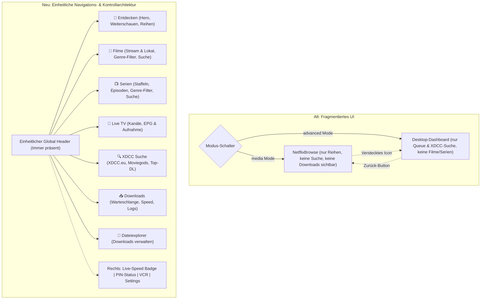

# AGY.md — Architektur- & Implementierungsplan: UI-Vereinheitlichung & Model Context Protocol (MCP) Server

**Projekt:** PulseCast (`xdcc-load-cast`)  
**Host:** BiggerPimmel (`/home/cb/Projects/xdcc-load-cast`)  
**Datum:** 19. September 2026  
**Status:** In Umsetzung  

---

## 1. Übersicht & Zielsetzung

PulseCast ist der zentrale Streaming- und Download-Hub für Medien über XDCC (IRC) und Xtream Codes (VOD/IPTV).
Das System wird um zwei wesentliche Säulen erweitert:

1. **Vollständige UI-Überarbeitung & Vereinheitlichung der Bedienelemente:**
   - Beseitigung der Zersplitterung zwischen 'media' und 'advanced' Modus.
   - Einheitlicher, moderner Global Header (`AppHeader.jsx`) für alle Seiten.
   - Permanenter Download-Hub im Header mit Live-Transfergeschwindigkeit und Item-Count.
   - Logische, übersichtliche Strukturierung der Kategorien für Filme und Serien (Quellen-Filter: Alle / Stream / Lokal; dynamische Genre-Chips; Live-Suche).
   - Ergonomische Zusammenführung der Suche (Katalogsuche für Filme/Serien sowie klassische XDCC/IRC-Suche nach Bots & Packs).

2. **Model Context Protocol (MCP) Server:**
   - Eigenständiger MCP-Server im Verzeichnis `mcp-server/index.js` unter Nutzung des offiziellen `@modelcontextprotocol/sdk` und `StdioServerTransport` (analog zu F1App).
   - Bereitstellung von 6 Kern-Tools:
     1. `pulsecast_get_downloads`: Listet aktive, wartende und abgeschlossene Downloads mit Speed, Status und ETA auf.
     2. `pulsecast_get_categories`: Liefert alle Kategorien und Genres für Filme und Serien.
     3. `pulsecast_search_catalog`: Durchsucht den VOD- und Medienkatalog nach Stichwort, Typ oder Kategorie.
     4. `pulsecast_search_xdcc`: Durchsucht xdcc.eu und IRC #moviegods nach Bot/Pack-Angeboten.
     5. `pulsecast_start_download`: Startet Downloads für VOD-Streams oder XDCC-Packs.
     6. `pulsecast_control_download`: Steuert Downloads (`pause`, `resume`, `cancel`).
   - Einbindung via `npm run mcp` und nahtlose Kommunikation mit dem PulseCast-Backend.

---

## 2. Problem- & Schwachstellenanalyse der bisherigen Benutzeroberfläche

### 2.1 Konkrete Schwachstellen im Detail:
1. **Header-Zersplitterung:**
   - Im *Media-Modus* renderte `NetflixBrowse` eine eigene `nb-navbar`, besaß aber keine globale Navigation zu Downloads, Explorer oder Einstellungen (nur ein kleines Zahnrad).
   - Im *Advanced-Modus* wurde der `AppHeader` geladen, welcher aber keinen Zugriff auf Mediathek, Filme oder Serien bot.
2. **Unsichtbare Downloads:**
   - Startete ein Benutzer im Media-Modus einen Download, gab es keinen persistenten Indikator für Fortschritt, Geschwindigkeit oder Fehler.
3. **Verstreute Suche:**
   - XDCC-Suche war nur im Advanced-Modus verfügbar.
   - Katalogsuche (nach VOD-Filmen und Serien) existierte nur in der alten `MediaLibrary`, welche im Media-Modus gar nicht gerendert wurde.
4. **Fehlende Kategorie-Strukturierung:**
   - Filme und Serien waren nicht sauber nach Genres, Typ und Quelle filterbar.

---

## 3. Architektur der UI-Vereinheitlichung

### 3.1 Globaler Header (`AppHeader.jsx`)
- **Brand:** PulseCast-Logo mit Cyan-Glow, Titel und Version.
- **Hauptnavigation (Tabs):**
  - `browse` (Entdecken)
  - `movies` (Filme)
  - `series` (Serien)
  - `livetv` (Live TV)
  - `xdcc` (XDCC Suche)
  - `explorer` (Dateien)
- **Kontrollzentrum (Rechts):**
  - **Download-Button mit Live-Badge:** Zeigt aktiven Download-Count und Live-Geschwindigkeit (z. B. `⚡ 12.4 MB/s`). Klick schaltet direkt auf `downloads` um.
  - **PIN-Indikator:** Schloss-Symbol für geschützte lokale Inhalte. Klick öffnet PIN-Eingabe.
  - **VCR-Button:** Direkter Zugriff auf geplante TV-Aufnahmen.
  - **Settings-Button:** Öffnet Systemeinstellungen.

### 3.2 Strukturierte Ansichten für Filme und Serien
- Sowohl in `movies` als auch in `series`:
  - **Quellen-Filter:** [Alle] [Stream (VOD)] [Lokal (PIN-geschützt)]
  - **Genre-Chips:** Dynamisch aus `availableSubcategories` generiert (z. B. Action, Komödie, Drama, Sci-Fi, Thriller, etc.).
  - **Katalog-Live-Suche:** Sofortiges Filtern nach Titeln, Schauspielern oder Regisseuren.
  - **Aktionen:** 1-Klick-Download, Abspielen in VLC, Cast-Unterstützung, Detailansicht.

---

## 4. Model Context Protocol (MCP) Server

### 4.1 Architektur & Protokoll
- Implementiert in `mcp-server/index.js` unter Nutzung von:
  - `@modelcontextprotocol/sdk/server/mcp.js` (`McpServer`)
  - `@modelcontextprotocol/sdk/server/stdio.js` (`StdioServerTransport`)
  - `zod` zur Schemavalidierung.
- Kommunikation via HTTP-REST gegen die lokale PulseCast-Instanz (`http://127.0.0.1:3000` bzw. `PULSECAST_URL`).

### 4.2 Tool-Spezifikation

| Tool Name | Zweck | Parameter |
|---|---|---|
| `pulsecast_get_downloads` | Listet aktive, wartende und beendete Downloads mit Status, Speed & Fortschritt | `filter` (optional: `'all'`, `'active'`, `'completed'`, `'queued'`) |
| `pulsecast_get_categories` | Liefert alle Kategorien und Genres für Filme und Serien | `type` (optional: `'all'`, `'movies'`, `'series'`) |
| `pulsecast_search_catalog` | Durchsucht VOD- und Medienkatalog nach Stichwort, Typ oder Kategorie | `query`, `type`, `category`, `genre`, `limit`, `page` |
| `pulsecast_search_xdcc` | Führt XDCC-Suche durch (xdcc.eu & #moviegods) | `query` (erforderlich), `source` (`'xdcc'`, `'moviegods'`, `'both'`) |
| `pulsecast_start_download` | Startet VOD-Stream- oder XDCC-Pack-Download | `downloadType`, VOD-Params (`stream_id`, `title`, `series_title`) oder XDCC-Params (`bot`, `pack`, `filename`) |
| `pulsecast_control_download` | Steuert Downloads | `id` (Download-ID), `action` (`'pause'`, `'resume'`, `'cancel'`) |

---

## 5. Verifikationsplan
1. `npm run build:frontend`: Fehlerfreier Produktions-Build des Client-Bundles.
2. `npm test`: Ausführen der Vitest-Suite.
3. MCP-Server-Funktionstest via Stdio-Transport.
4. Systemd-Neustart: `systemctl --user restart pulsecast.service` und Verifikation der Verfügbarkeit.
5. Saubere Git-Commits und Push auf den Tracking-Branch `main`.
